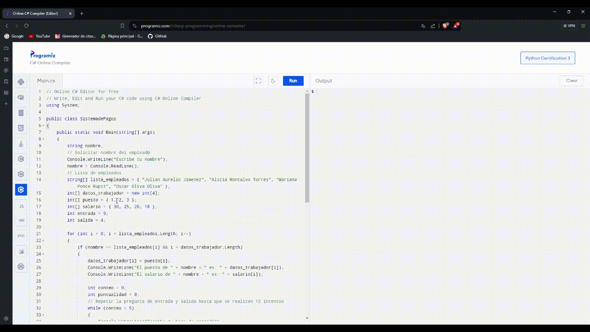

## Sistema de gestión de pagos a trabajadores de maquila

Este proyecto implica la creación de un sistema integral para la administración de horarios de entrada y salida, así como la asignación de áreas específicas a cada trabajador dentro de una maquila. Se buscará incorporar detalles cruciales, como el nombre, número de seguridad social, el puesto particular de cada empleado en relación con su salario y responsabilidades dentro de la organización. 

#Notas: 
El archivo `index.cs` es la primera versión de este proyecto. El archivo `sistema_pagos.cs` es la versión final.
